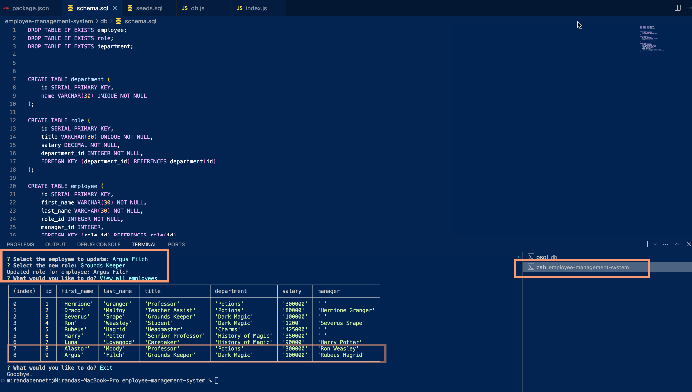

# Employee Management System (Harry Potter Theme)

## Description

This Employee Management System is a command-line application built as part of Challenge 12 SQL. It showcases the use of PostgreSQL and demonstrates functionality for creating databases, tables, and updating data based on user prompts. The application is themed around Harry Potter, providing a fun and engaging way to interact with a SQL database.

## Table of Contents

* [Installation](#installation)
* [Usage](#usage)
* [Features](#features)
* [Technologies Used](#technologies-used)
* [License](#license)
* [Contributing](#contributing)
* [Tests](#tests)
* [Questions](#questions)
* [Future Enhancements](#future-enhancements)

## Installation

1. Clone the repository:
2. Navigate to the project directory:
3. Install dependencies:
4. 4. Ensure you have PostgreSQL installed and running on your machine.
5. Set up your database using the provided schema.sql and seeds.sql files.

## Usage

To test the functionality using the command line, please follow these steps:

1. Open terminal from the project root directory
2. Run the application:
3. 3. Select prompt answers as applicable
4. Review updates and/or changes submitted

For a detailed walkthrough, please refer to the video demonstration linked below.

## Features

- View all departments
- View all roles
- View all employees
- Add a department
- Add a role
- Add an employee
- Update an employee role

## Technologies Used

- Node.js
- PostgreSQL
- Inquirer.js

## License

This project is licensed under the MIT License.

## Contributing

We are not currently accepting contributions to this project.

## Tests

No tests are provided for this challenge.

## Questions

If you have any questions, please feel free to contact me:

* GitHub: [mlipscomb24](https://github.com/mlipscomb24)
* Email: mbennett.sa@outlook.com

## Video Walkthrough

Here is a link to the video walkthrough of the project:

[Screencastify Video Walkthrough](https://app.screencastify.com/v3/watch/1ndnxxw0OQKPtcMtA9GV) <!-- Add your video link here -->

## Screenshots

 <!-- Add your screenshot here -->

## Future Enhancements

